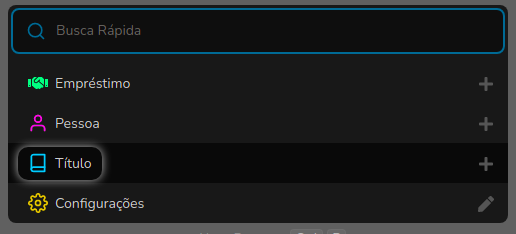

# Borrow screen

The loan screen was designed to be as dynamic as possible. This screen can be accessed through the quick shortcut: `Ctrl+b`.

It has a field in the header:

* **Person**: Is the person who owns and/or wants to make loans and/or reserves the securities.

It also has two tabs: Borrow and Return. Both with pagination feature.

### Borrow Tab

The Borrow tab is where we record borrow/reserves for a person and has the following fields:

* **Title**: It is the Title along with its classification that will be borrowed/reserved.
* **Borrow Date**: It is the date when the Title was borrowed, it is not very important in the case of a reserve.
* **Return Date**: It is the date when the Title must be returned, it is not very important in the case of a reservation.
* **Reserve**: By checking this field, the system is told to reserve the Title.

_Note_: The Borrow Date and Return Date fields are not important in the case of a reservation, because when the reservation is effected on a loan, the dates will be automatically updated according to the settings on the [Settings screen](settings-screen.md).

After the fields are correctly filled in, just click on the `+` button to make the borrow/reserve.

The icon .png>), when clicked, performs the **Renewal** of a borrow also according to the settings on the [Settings screen](settings-screen.md).

The icon .png>), when clicked, performs the **Return** of a borrow.

Let's talk about the Reservations tab next.

### Reservations Tab

Once the "Reserve" option has been checked the Reserved Titles appear on this tab. It has no fields.

And the icon .png>), when clicked, makes the **Borrow** of a reserved Title.

.png>)

And this is how the Borrow screen works.
