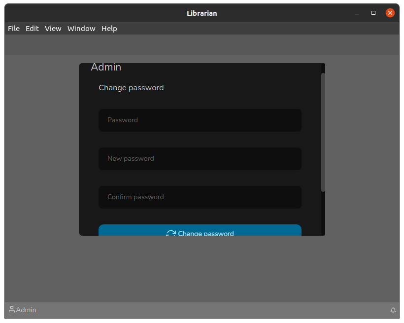

# Home screen

The home screen has some quick shortcut reminders. There's not much to explain, it's a self-explanatory screen, as can be seen in the following image:

### Changing user's password

To change the user's password, simply click on the user's name that appears in the lower left corner, and then the following screen will be displayed:

Just fill in the fields accordingly and click on the "Change password" button, that's it! Changed password.

To exit Librarian, below the "Change password" button there is the "Logout" button, which when clicked will take you to the login screen.
