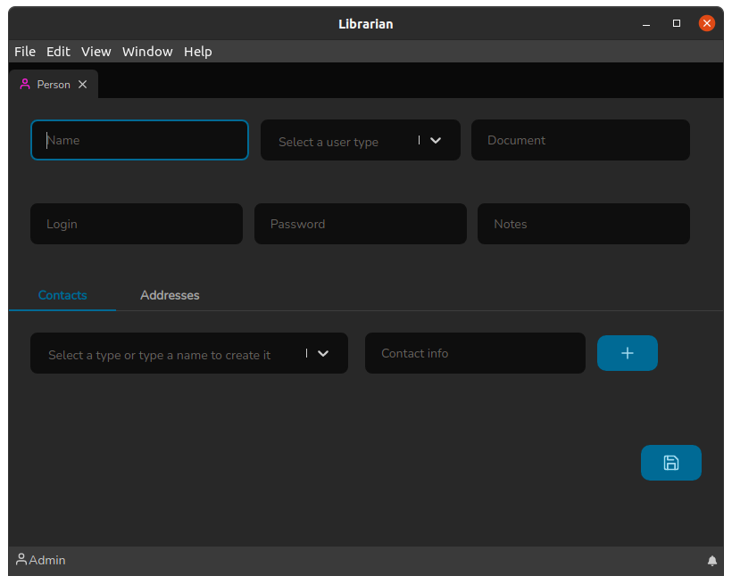

# Person screen

The Person Screen is where people who borrow Titles will be registered. And it can be accessed through the quick shortcut: `Ctrl+p`.

The header of this screen consists of the following fields:

* **Name**: Where the name of the person must be informed.
* **User Type**: Field to choose the person's profile, currently there are only 3 (Administrator, Librarian and Person), where the first two are who administers the system and the last is the profile for who actually borrows the titles.
* **Document**: It serves to inform a document of the person, for example, in the case of students from a school, the Student Registry (SR) can be informed.
* **Login**: A username for the person, to use in a future query system.
* **Password**: A password for the person also to use in a future query system and login into Librarian. If this field is informed when changing a record, the password will be updated. This feature has been implemented in case the user forgets the password.
* **Notes**: Any comment you want to make about a particular person.

The Person screen has two subdivisions: Contacts and Addresses. Let's talk about them now.

### Contacts Tab

The Contacts tab is where we register a person's contacts and has the following fields:

* **Contact type**: It is the type of contact, for example: email, phone, cell phone, twitter, etc. In this field you can write the name of a type and if it is already registered it will appear in the list, then just select it, if it does not exist, the creation option will appear by pressing `Enter` to create it.
* **Contact information**: It is the contact information itself, for example: @twitter\_user or (555) 555-1234 or mail@serve.com.

After the fields are correctly filled in, just click on the `+` button to insert the record. This allows you to link several contacts to the same Person.

_Note_: When clicking the `+` button nothing has been saved yet, it only happens when the save button is clicked.

💡Tip: To save a person just press `Ctrl+S`.

Now let's check how the Addresses Tab works

### Addresses Tab

The Addresses tab is where we link the various possible addresses to a Person, it has the following fields:

* **City**: It is the city referring to the address. In this field you can write the name of a city and if it is already registered it will appear in the list, so just select it.
* **Zipcode/Postalcode**: This is the well-known code used by parcel and postal delivery services.
* **Public Place**: It is the street, avenue, alley etc where the property is located.
* **Number**: It is the property number.
* **Neighborhood**: It is the neighborhood in which the property is located.
* **Complement**: Any possible complement to the address, for example: front house.

After the fields are correctly filled in, just click on the `+` button to insert the record. This allows you to link multiple editions to the same title.

On this screen, the city field has a particularity, it has a `+` icon that composes it. By clicking this icon, the add city screen will appear:

It is a relatively simple screen to understand and has the following fields:

* **Country**: The country to which the State belongs, new ones can be added by simply typing the name and pressing `Enter`.
* **State**: The State to which the City belongs, the operation is the same as the country field, just type the name and press `Enter` to add a new state.
* **City**: The name of the city to be added.

To add the city just click on the Save button :floppy\_disk:.
