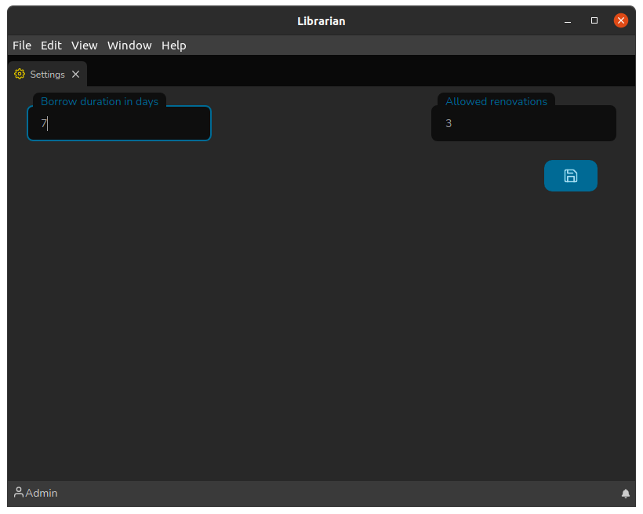

# Tela de configurações

A tela de configurações é simples e atualmente possui os seguintes campos:

* **Duração do empréstimo em dias**: É a quantidade de dias até o dia em que o Título deve ser devolvido.
* **Renovações permitidas**: É a quantidade de renovações do empréstimo de um Título.

Ao alterar os valores basta clicar no botão salvar :floppy\_disk: para que as alterações tenham efeito.
