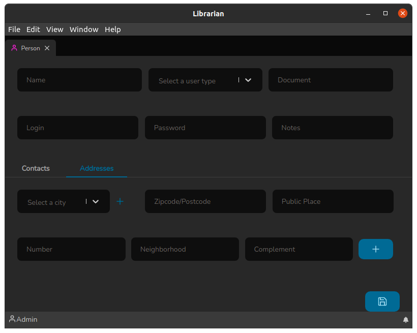
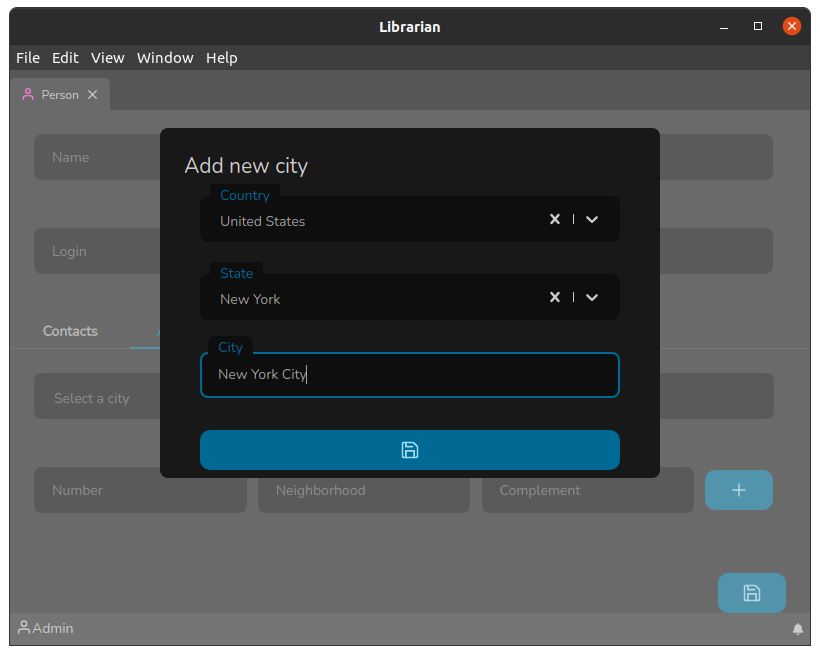

# Tela de pessoa

A Tela de Pessoa é onde serão cadastradas a pessoas que realizam os empréstimos de Títulos. E pode ser acessada através do atalho rápido: `Ctrl+p`.

O cabeçalho dessa tela consiste nos seguintes campos:

* **Nome**: Onde deve ser informado o nome da pessoa.
* **Tipo de Usuário**: Campo para escolher qual é o perfil da pessoa, atualmente existem apenas 3 (Administrador, Bibliotecário e Pessoa), onde os dois primeiros são quem administra o sistema e o último é o perfil para quem de fato empresta os títulos.
* **Documento**: Serve para informar um documento da pessoa, por exemplo, em caso de alunos de uma escola, pode ser informado o Registro de Aluno (RA).
* **Login**: Um usuário para a pessoa, para usar num futuro sistema de consulta.
* **Senha**: Uma senha para a pessoa, para usar num futuro sistema de consulta.
* **Observações**: Qualquer comentário que queira realizar sobre a determinada pessoa.

A tela de Pessoa possui duas subdivisões: Contatos e Endereços. Vamos falar delas agora.

### Guia Contatos

A guia de Contatos é onde registramos os contatos uma pessoa e possui os seguintes campos:

* **Tipo de contato**: É o tipo de contato, por exemplo: e-mail, telefone, celular, twitter etc. Nesse campo pode-se escrever o nome de um tipo e se o mesmo já estiver cadastrado irá aparecer na lista, então basta selecioná-lo, caso o mesmo não exista, a opção de criação aparecerá bastando pressionar `Enter` para que o mesmo seja criado.
* **Informação do contato**: É a informação do contato propriamente dito, por exemplo: @usuario\_twitter ou (11) 12345-6789 ou ainda email@servidor.com.br.

Após os campos serem corretamente preechidos, basta clicar no botão `+` para inserir o registro. O que permite vincular diversos contatos a mesma Pessoa.

_Nota:_ Ao clicar no botão `+` nada foi salvo ainda, isso só ocorre quando o botão salvar :floppy\_disk: for clicado.

Vamos verificar agora o funcionamento da Guia Endereços

### Guia Endereços

A guia de Endereços é onde vinculamos os diversos possíveis endereços a uma Pessoa, ela possui os seguintes campos:

* **Cidade**: É a cidade refrente ao endereço. Nesse campo pode-se escrever o nome de uma cidade e se a mesma já estiver cadastrada irá aparecer na lista, então basta selecioná-la.
* **CEP**: É o já conhecido código utilizado pelos serviços de entrega de encomenda e postal.
* **Logradouro**: É a rua, avenida, viela etc o qual se encontra o imóvel.
* **Número**: É número do imóvel.
* **Bairro**: É o bairro o qual o imóvel é localizado.
* **Complemento**: Algum possível complemento ao endereço, por exemplo: casa da frente.

Após os campos serem corretamente preechidos, basta clicar no botão `+` para inserir o registro. O que permite vincular diversas edições ao mesmo título.

Nesta tela o campo cidade possui uma particularidade, ele possui um ícone `+` que o compõe. Ao clicar nesse ícone, a tela de adicionar cidade irá aparecer:

É uma tela relativamente simples de entender e possui os seguintes campos:

* **País**: O país ao qual o Estado pertence, podem ser adicionados novos bastando apenas digita o nome e pressionar `Enter`.
* **Estado**: O Estado ao qual a Cidade pertece, o funcionamento é o mesmo do campo país, bastando apenas digita o nome e pressionar `Enter` para adicionar um novo estado.
* **Cidade**: O nome da cidade que deve ser adicionada.

Para adicionar a cidade basta clicar no botão Salvar :floppy\_disk:.
