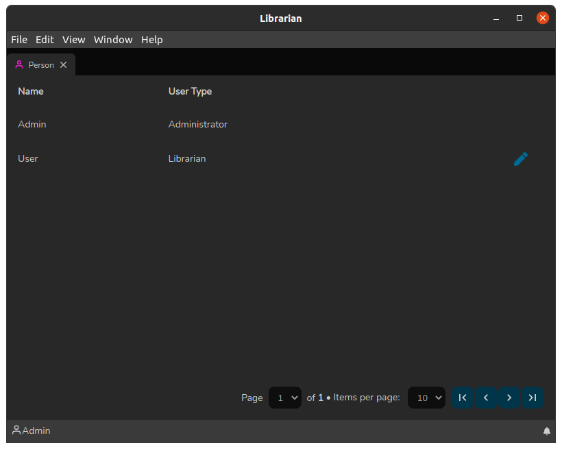

# Listagem de Pessoas

A tela de Listagem de Pessoas funciona de maneira simples: É uma tela onde ao clicar sobre uma linha da lista o sistema redireciona para a tela de Detalhes da Pessoa.

Essa tela pode ser acessada pelo _QuickSearch_ (`Ctrl+F`) e clicando sobre Pessoa:

 (1).png>)

Ao clicar no ícone de lápis, o sistema redireciona para tela de [Edição de Pessoa](./). Vale comentar que essa tela possui também um recurso de paginação.

