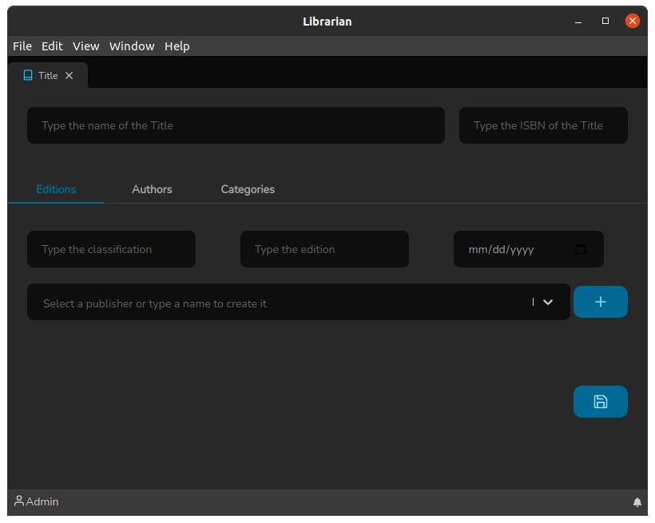

# Tela de títulos

A tela de Título é onde de fato devem ser cadastradas as publicações. E pode ser acessada através do atalho rápido: `Ctrl+t`.

O cabeçalho dessa tela consiste em:

* Um campo para informar o no nome do Título
* Um campo para informar o ISBN (_International Standard Book Number_)

A tela de Títulos possui três subdivisões: Edições, Autores e Categorias. Vamos falar sobre cada uma delas

### Guia Edições

A guia de Edições é onde criamos uma identificação única para o Título dentro de uma biblioteca, elas possui os seguintes campos:

* **Classificação**: Também conhecido como tombo, é o identificador único que é dado a uma publicação, afinal pode-se possuir publicações repetidas em uma biblioteca.
* **Edição**: É a edição que normalmente se encontra junto a ficha catalográfica de uma publicação.
* **Data Publicação**: É a data referente a quando e edição foi publicada.
* **Editora**: É a editora que lançou a referida edição. Nesse campo pode-se escrever o nome de uma editora e se a mesma já estiver cadastrada irá aparecer na lista, então basta selecioná-la, caso a mesma não exista, a opção de criação aparecerá bastando pressionar `Enter` para que a mesma seja criada.

Após os campos serem corretamente preechidos, basta clicar no botão `+` para inserir o registro. O que permite vincular diversas edições ao mesmo título.

_Nota:_ Ao clicar no botão `+` nada foi salvo ainda, isso só ocorre quando o botão salvar :floppy\_disk: for clicado.

Vamos agora verificar como funciona a Guia Autores.

### Guia Autores

A Guia Autores é onde referenciamos os autores à publicação, ela é bem simples e possuio apenas um campo:

* **Autor**: Esse campo funciona da seguinte forma: pode-se escrever o nome do autor e se o mesmo já estiver cadastrado irá aparecer na lista, então basta selecioná-lo, caso o mesmo não exista, a opção de criação aparecerá bastando pressionar `Enter` para que o mesmo seja criado, assim como o campo Editora da Guia Edições.

Após os campos serem corretamente preechidos, basta clicar no botão `+` para inserir o registro.  O que permite vincular diversos autores ao mesmo título.

.png>)

Vamos falar agora da Guia Categoria.

### Guia Categoria

Basicamente funciona igual a Guia Autores. Porém o princípio em relação a organização a biblioteca é categorizar de forma fácil as Títulos.

Possui apenas um campo:

* **Categoria**: Esse campo funciona da seguinte forma: pode-se escrever o nome da categoria e se a mesma já estiver cadastrada irá aparecer na lista, então basta selecioná-la, caso a mesma não exista, a opção de criação aparecerá bastando pressionar `Enter` para que a mesma seja criada, assim como o campo Editora da Guia Edições e o campo Autor da Guia Autores.

Após os campos serem corretamente preechidos, basta clicar no botão `+` para inserir o registro.  O que permite vincular diversas categorias ao mesmo título.

E esse é o funcionamento da Tela de inclusão/edição de Títulos.
