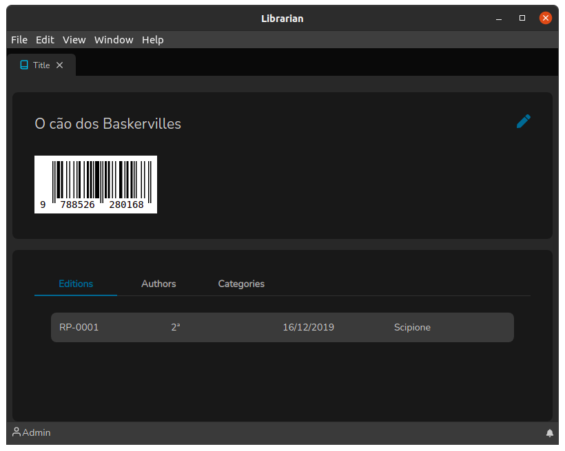

# Detalhes do Título

A tela de Listagem de Títulos funciona de maneira muito simples: mostra os detalhes de um título, como pode ser observado na imagem abaixo.

Ao clicar no ícone de lápis, o sistema redireciona para tela de [Edição de Títulos](./).
