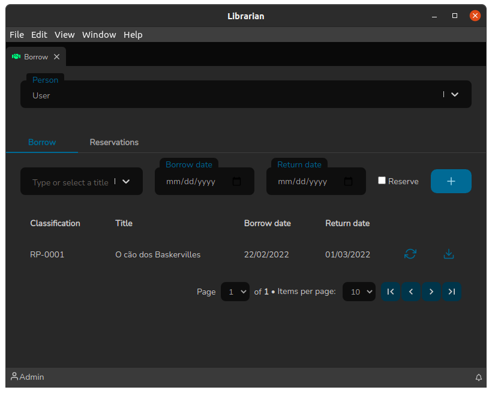

# Listagem de Títulos

A tela de Listagem de Títulos funciona de maneira simples: É uma tela onde ao clicar sobre uma linha da lista o sistema redireciona para a tela de [Detalhes do Título](detalhes-do-titulo.md).

Essa tela pode ser acessada pelo _QuickSearch_ (`Ctrl+F`) e clicando sobre Título:

Ao clicar no ícone de lápis, o sistema redireciona para tela de [Edição de Títulos](./). Vale comentar que essa tela possui também um recurso de paginação.

.png>)
