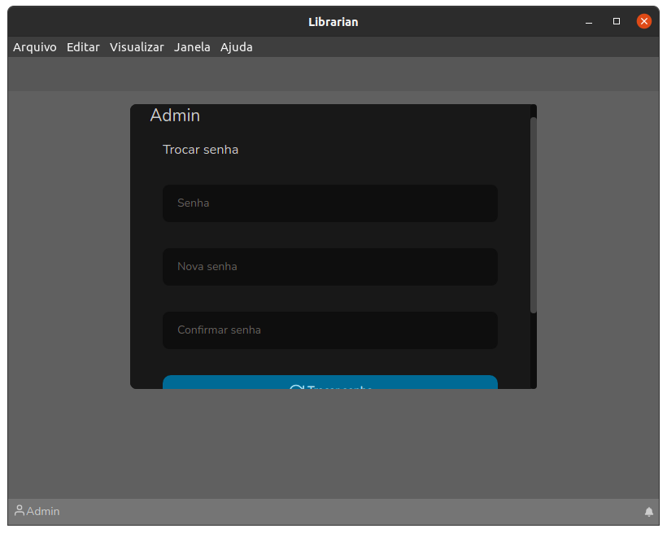

# Tela inicial

A tela inicial possui alguns lembretes de atalhos rápidos. Não tem muito o que explicar, é uma tela auto explicativa, como pode ser verificado na seguinte imagem:

### Alterando a senha do usuário

Para alterar a senha do usuário, basta clicar no nome do mesmo que aparece no canto inferior esquerdo, e então a seguinte tela será exibida:

Basta preencher os campos de acordo e clicar no botão "Trocar senha", pronto! Senha alterada.

Para sair do Librarian abaixo do botão "Trocar senha" existe o botão "Sair", que ao ser clicado levará para a tela de login.
