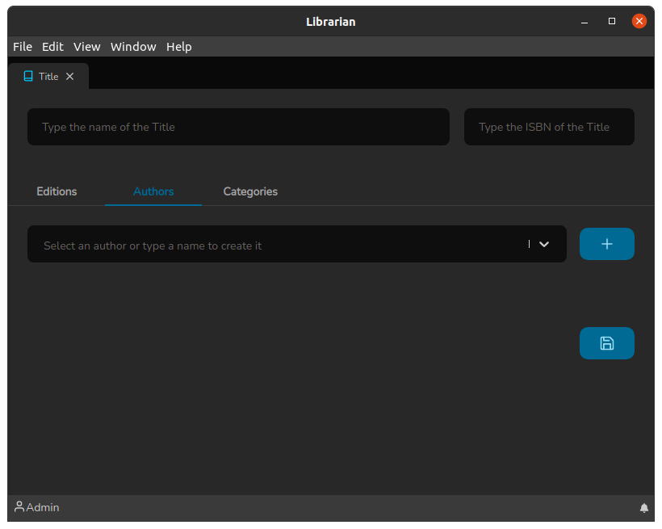
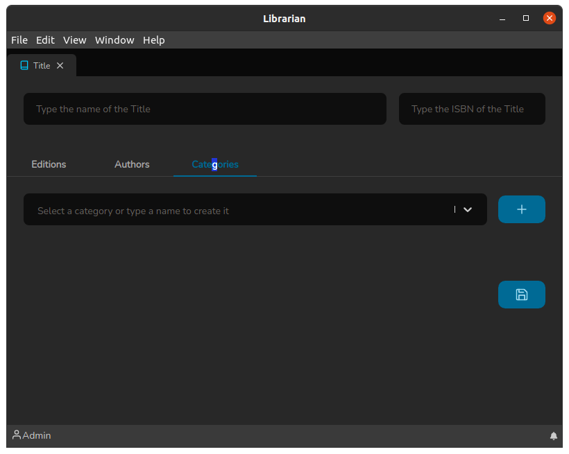

# Title screen

The Title screen is where the publications should actually be registered. And it can be accessed through the quick shortcut: `Ctrl+t`.

The header of this screen consists of:

* A field to inform the Title name
* A field to enter the ISBN (International Standard Book Number)

The Titles screen has three subdivisions: Editions, Authors and Categories. Let's talk about each of them

### Editions Tab

The Edits tab is where we create a unique ID for the Title within a library, it has the following fields:

* **Classification**: It is the unique identifier that is given to a publication, after all, you can have repeated publications in a library.
* **Edition**: It is the edition that is normally found next to the catalog of a publication.
* **Published At**: It is the date referring to when the edition was published.
* **Publisher**: It is the publisher that launched this edition. In this field you can write the name of a publisher and if it is already registered it will appear in the list, so just select it, if it does not exist, the creation option will appear by pressing `Enter` to create it.

After the fields are correctly filled in, just click on the `+` button to insert the record. This allows you to link multiple editions to the same title.

_Note_: When clicking the `+` button nothing has been saved yet, it only happens when the save :floppy\_disk: button is clicked.

Let's check how the Authors Tab works.

### Authors Tab

The Authors Tab is where we refer the authors to the publication, it is very simple and has only one field:

* **Author**: This field works as follows: you can write the author's name and if it is already registered it will appear in the list, so just select it, if it does not exist, the creation option will appear by pressing `Enter` to to be created, as well as the Publisher field of the Editions Tab.

After the fields are correctly filled in, just click on the `+` button to insert the record. This allows you to link several authors to the same title.

Now let's talk about the Category Tab.

### Categories Tab

Basically it works the same as the Authors Tab. But the principle in relation to the organization of the library is to easily categorize the Titles.

It has only one field:

* **Category**: This field works as follows: you can write the name of the category and if it is already registered it will appear in the list, so just select it, if it does not exist, the creation option will appear by pressing `Enter` to be created, as well as the Publisher field of the Editions Tab and the Author field of the Authors Tab.

After the fields are correctly filled in, just click on the `+` button to insert the record. This allows you to link several categories to the same title.

And this is how the Titles inclusion/editing screen works.
