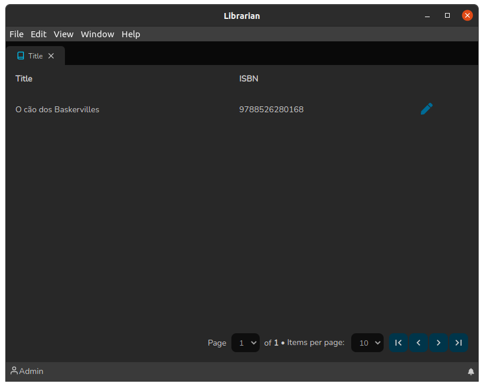

# Title List

The Title List screen works in a simple way: It is a screen where when clicking on a line in the list, the system redirects to the [Title Details](title-details.md) screen.

This screen can be accessed by QuickSearch (`Ctrl+F`) and clicking on Title:

.png>)

When clicking on the pencil icon, the system redirects to the [Title Editing](./) screen. It is worth mentioning that this screen also has a pagination feature.

